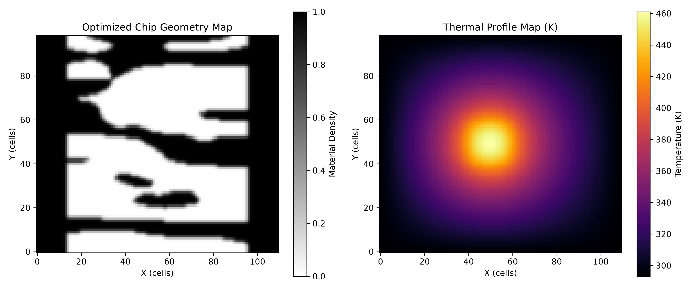
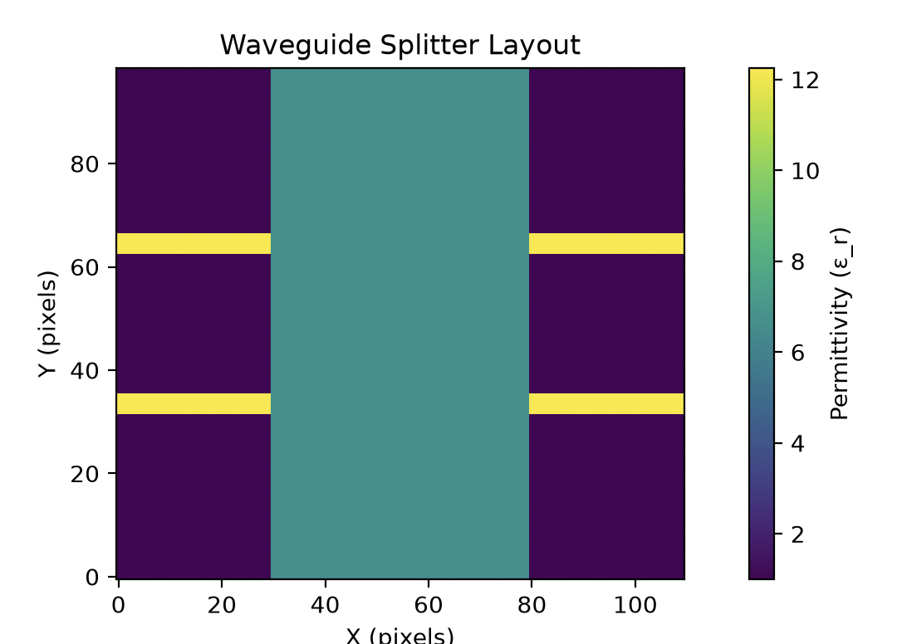

## Timeline & Milestones

### Milestone 1 — Simulation code finished (Sept 5)
- [ ] **Heater model**
  - [ ] Create Heater and make sure it passes a simulation test before moving to:
    - [ ] Write the heater code that adds heat and calculates how it spreads across the area
    - [ ] Plot temperature graphs to make sure hot spots show up in the right spots and at the right temperatures
    - [ ] Double-check the solver against a standard math formula to prove it is accurate
- [ ] **Testing area setup**
 
- [x] Create test area and check with a static heater
- [x] Succesfully integrate with splitter
  - [ ] Adjust the beam splitter layout to make sure the size, boundaries, and materials match what the temperature solver needs
  - [ ] Check that the built-in laser light source works correctly once heat-driven changes are added
- [ ] **Splitter model**
      
  -  [ ] Create Splitter and make sure it passes a simulation test before moving to:
    - [ ] Run the default beam splitter at room temperature to make sure results match expected baseline numbers
    - [ ] Update the simulation so it adjusts the material properties based on temperature changes from hot spots
    - [ ] Measure how well light splits and passes through the device using performance metrics
- [ ] **System integration & math checks**
  - [ ] Connect the full process: Heat inputs → Temperature map → Material changes → Light simulation → Performance score
  - [ ] Set up the light-tracking optimization gradient
  - [ ] Set up the heat-tracking optimization gradient and connect both using the math chain rule
  - [ ] Run a manual check to confirm both gradient calculations are accurate
  - [ ] Test one hot spot scenario from start to finish to ensure the results make sense

### Milestone 2 — Testing & data gathering finished (Oct 1)
- [ ] Verify that running the exact same test setup always produces the exact same results
- [ ] **Automation**
  - [ ] Create a script to automatically test various hot spot locations, temperatures, and sizes
  - [ ] Set up automatic logging to save heat settings, light metrics, and test performance to a file
  - [ ] Add error-handling so long batch runs can recover and keep going if something crashes
  - [ ] Add a save-point system so long optimization runs do not lose progress
- [ ] Collect a complete dataset covering at least 20 different hot spot scenarios
- [ ] Split the data into training and testing sets *before* optimizing the heater on hidden test scenarios

### Milestone 3 — Data analysis & stats (Nov 1–30)
- [ ] Clean up the data and double-check for errors or weird outliers
- [ ] Test if the data follows a standard bell curve (Shapiro–Wilk test)
- [ ] Run statistical comparison tests to check for meaningful differences and measure how big those differences are
- [ ] Run an equivalence test to see if the corrected version performs just as well as an undisturbed baseline
- [ ] Chart how correction quality changes as hot spots get more severe
- [ ] Verify that the setup works well on new test scenarios it has not seen before
- [ ] Adjust statistical calculations if testing multiple hot spot categories to avoid false positives
